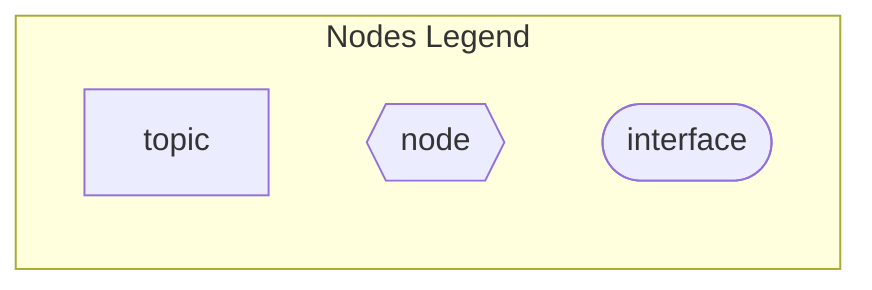
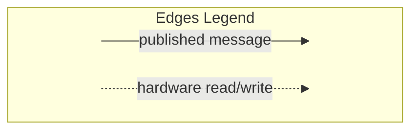
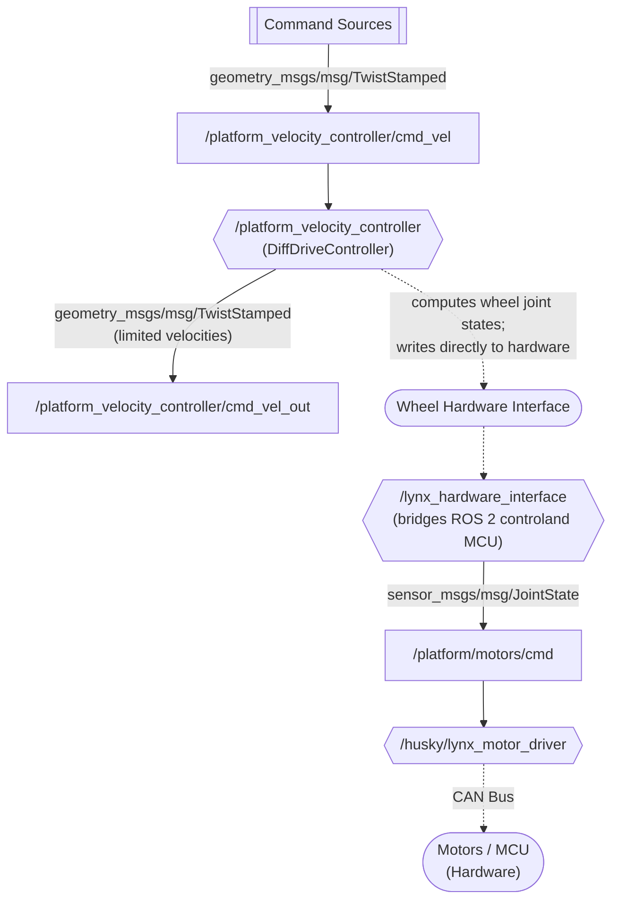

# Commanding Clearpath Platform

Clearpath platforms (mostly) utilize the [ros2_control framework](https://control.ros.org/rolling/doc/getting_started/getting_started.html#architecture).
But communication to the MCU (see [Clearpath Hardware Architecture](./Clearpath_Hardware_Architecture.md) for more details) keeps the ROS 2 infrastructure slightly removed from the physical hardware.
This means that tracing down commands to the hardware can be a little tricky.

> [!NOTE] The Short Version!
> Velocity commands go from the **platform velocity controller**,
> to the **Lynx hardware interface**,
> to the **Lynx motor driver**
> to command Togo!

For anyone who wants more information about how these nodes communicate (with links to source code!),
let's trace through the nodes that make it possible to control Togo!

## Summary Flowchart

    
Flowchart Legends

## ROS 2 Control Resources

The ROS 2 control framework is open source!
We'll explain the basics here, but reviewing the code may be helpful for a deep-dive.

- [`ros2_control`](https://github.com/ros-controls/ros2_control)
- [`ros2_controllers`](https://github.com/ros-controls/ros2_controllers)

## Platform Velocity Controller

Velocity commands will end up at the `/platform_velocity_controller`, which is a differential drive (`DiffDriveController`) ROS 2 controller.
Whether from the command line, joystick teleop control, etc.,
commands of type `geometry_msgs/msg/TwistStamped` need to be published to topic `/platform_velocity_controller/cmd_vel` to reach the controller.
The `/platform_velocity_controller` will republish the received commands (with limited velocities) on `/platform_velocity_controller/cmd_vel_out`,
but as of right now, nothing listens to this topic.

A ROS 2 controller will compute commands for the relevant hardware interfaces and write directly to the hardware.
In this case, the `/platform_velocity_controller` takes the commanded velocity, computes the required joint states for the Husky wheels,
and tries to write directly to the wheel interfaces
(for those curious enough to look at the source code,
see the `DiffDriveController` [overridden ROS 2 controller function](https://github.com/ros-controls/ros2_controllers/blob/jazzy/diff_drive_controller/src/diff_drive_controller.cpp#L142),
specifically where [commands are written to the wheels](https://github.com/ros-controls/ros2_controllers/blob/jazzy/diff_drive_controller/src/diff_drive_controller.cpp#L292)).

Typically, this is what enables ROS 2 controllers to command the robot hardware!
But we know that the [CAN bus needs to communicate between the robot computer and MCU](./Clearpath_Hardware_Architecture.md#can), so our journey continues...

## Lynx Hardware Interface

ROS 2 hardware interfaces typically do not get wrapped up in ROS 2 nodes since the ROS 2 controller can write directly to those resources.
Clearpath does provide hardware interface nodes to bridge the gap between the ROS 2 control framework and the MCU.
For Togo, the `/lynx_hardware_interface` takes the wheel commands from the `/platform_velocity_controller`,
[creates a joint state message](https://github.com/clearpathrobotics/clearpath_robot/blob/jazzy/clearpath_hardware_interfaces/src/lynx/hardware.cpp#L54) of type `sensor_msgs/msg/JointState`,
and [sends the command to the hardware](https://github.com/clearpathrobotics/clearpath_robot/blob/jazzy/clearpath_hardware_interfaces/src/lynx/hardware.cpp#L97).
We can see this hardware command [published onto topic `/platform/motors/cmd`](https://github.com/clearpathrobotics/clearpath_robot/blob/jazzy/clearpath_hardware_interfaces/src/lynx/hardware_interface.cpp#L82).

Now we're so close to the actual motors...!

## Lynx Motor Driver

The `/husky/lynx_motor_driver`
[subscribes to the joint state messages](https://github.com/clearpathrobotics/clearpath_robot/blob/jazzy/clearpath_motor_drivers/lynx_motor_driver/src/lynx_motor_node.cpp#L276)
from topic `/platform/motors/cmd` and
[sends these commands](https://github.com/clearpathrobotics/clearpath_robot/blob/jazzy/clearpath_motor_drivers/lynx_motor_driver/src/lynx_motor_node.cpp#L290)
to the motors
[via the CAN bus](https://github.com/clearpathrobotics/clearpath_robot/blob/jazzy/clearpath_motor_drivers/lynx_motor_driver/src/lynx_motor_driver.cpp#L503).

Yay :tada: our command made it to the motors!
